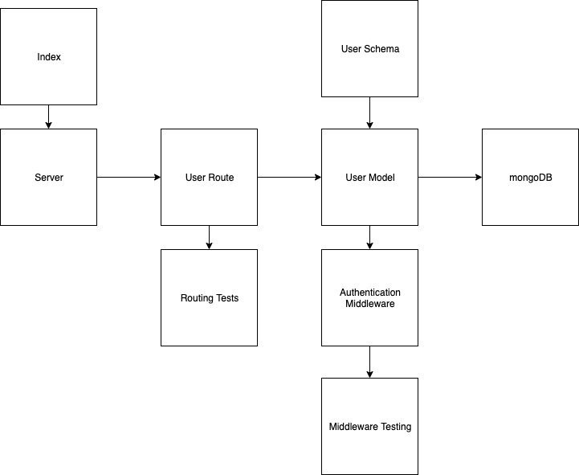

# LAB - 14

## Access Control

### Author: Trevor Thompson

### Links and Resources
* [submission PR](https://github.com/trevorthompson-401-advanced-javascript/lab13-auth-server/pull/1)
* [travis](http://xyz.com)
* [back-end](http://xyz.com) (when applicable)

#### Documentation
* [api docs](http://xyz.com/api-docs) (API servers)

### Setup
#### `.env` requirements (where applicable)
* `PORT` - Port Number
* `MONGODB_URI` - URL to the running mongoDB
* `CLIENT_ID` - Github OAuth ID
* `CLIENT_SECRET` - Github OAuth Secret
* `API_SERVER` - `http://localhost:3000/oauth`
* `TOKEN_SERVER` - `https://github.com/login/oauth/access_token`
* `REMOTE_API` - `https://api.github.com/user`

#### Server Initialization
* `npm start`
* Endpoint: `/docs`
  * Returns JSdocs
* Endpoint: `/api-docs`
  * Returns swaggerDocs
* Endpoint: `/users`
  * Get all users in the database
* Endpoint: `/signup`
  * Posts new user to database
* Endpoint: `/signin`
  * Posts authorization header against user in database

  
#### Tests
* Unit Tests: `npm test`
* Lint Tests: `npm run lint`

#### UML

